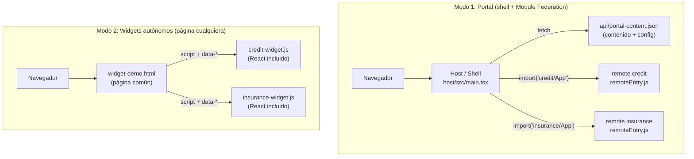

# ◆ NovaBank Portal — Micro Frontends, Module Federation y widgets autónomos

> Portal bancario **ficticio** de portafolio. Un *shell* (host) carga en tiempo de ejecución dos **micro frontends** independientes (simulador de crédito y cotizador de seguros) con **Module Federation**. Además, cada uno se compila **también como widget autónomo**: un único `.js` que se pone en cualquier página HTML y se configura con atributos `data-*`, imitando el modelo de *widgets* de plataformas de experiencia digital como **Modyo**.

**Demo:** `[LINK DE LA DEMO]` · **Widgets en una página común:** `[LINK DE LA DEMO]/widget-demo.html` · **Autor:** Luis Morales

---

## Índice
1. [Resumen en 30 segundos](#1-resumen-en-30-segundos)
2. [Conceptos clave explicados simple](#2-conceptos-clave-explicados-simple)
3. [Arquitectura](#3-arquitectura)
4. [Estructura del repositorio](#4-estructura-del-repositorio)
5. [Cómo correrlo en local](#5-cómo-correrlo-en-local)
6. [Despliegue gratuito](#6-despliegue-gratuito)
7. [Recorrido por el código, parte por parte](#7-recorrido-por-el-código-parte-por-parte)
8. [Los 5 ajustes de la versión 2: qué, por qué y cómo](#8-los-5-ajustes-de-la-versión-2-qué-por-qué-y-cómo)
9. [Mapeo a Modyo](#9-mapeo-a-modyo)
10. [Guion para explicar el proyecto](#10-guion-para-explicar-el-proyecto)
11. [Alcance, limitaciones y roadmap](#11-alcance-limitaciones-y-roadmap)

---

## 1. Resumen en 30 segundos

- **Qué es:** un portal bancario de mentira, hecho de piezas independientes.
- **Qué demuestra:** que sé construir portales con **micro frontends** en React + TypeScript, compartir dependencias con **Module Federation**, empaquetar piezas reutilizables como **widgets** configurables por atributos y separar el **contenido** del código.
- **Qué NO es:** no es un banco real ni usa la plataforma Modyo. Replica sus *conceptos* (widgets, páginas, contenido, configuración desde la página), y esa distinción está explicada con honestidad en la [sección 9](#9-mapeo-a-modyo).

Las dos maneras de usar cada widget:

| Modo | Cómo se carga | Cuándo sirve |
|---|---|---|
| **Federado** (Module Federation) | El shell hace `import('credit/App')` y comparte React con el widget | Cuando controlas el portal completo y todo es React |
| **Autónomo** (bundle `.js`) | `<script src="credit-widget.js">` + un `<div data-nb-widget="credit">` | Cuando otra página/plataforma aloja el widget y no sabes con qué tecnología está hecha |

---

## 2. Conceptos clave explicados simple

**Micro frontend.** La idea de los microservicios aplicada a la interfaz: en vez de una app gigante, varias piezas pequeñas, cada una con su código, su build y su despliegue, que se ensamblan en una misma página.

**Shell / host.** La página "contenedora": pone header, menú y layout, y decide qué piezas cargar.

**Remote.** Una pieza que el host carga desde fuera (aquí: `credit` e `insurance`).

**Module Federation.** Mecanismo (nació en Webpack 5; aquí se usa con `@module-federation/vite`) para que una app cargue **código de otra app en tiempo de ejecución**, sin recompilar. Cada remote publica un `remoteEntry.js` (su "catálogo" de lo que expone) y el host lo consulta. También permite **compartir librerías** (React) para no cargarla dos veces.

**Widget.** Una pieza de UI autocontenida que se inserta en una página. En Modyo, según su documentación, *widget* y *micro frontend* se usan casi como sinónimos.

**Liquid.** Lenguaje de plantillas del lado servidor. La plataforma lo "rellena" antes de enviar el HTML al navegador, por ejemplo para inyectar valores del sitio o del usuario. En este proyecto **no se usa Liquid**; se imita la *idea* con atributos `data-*` (ver sección 8.3).

**DXP (plataforma de experiencia digital).** Software para construir portales a base de sitios, páginas, contenido gestionado y widgets. Modyo es una DXP.

---

## 3. Arquitectura



**Idea central:** los componentes `credit/src/App.tsx` e `insurance/src/App.tsx` son **uno solo en cada remote** y se compilan de **dos formas** (cada una con su propio archivo de configuración de Vite). No hay código duplicado de lógica.

| Paquete | Build federado (`npm run build`) | Build autónomo (`npm run build:widget`) |
|---|---|---|
| `credit/` | `dist/` → `remoteEntry.js` (lo consume el shell) | `dist-widget/credit-widget.js` (React incluido) |
| `insurance/` | `dist/` → `remoteEntry.js` | `dist-widget/insurance-widget.js` |
| `host/` | `dist/` → el portal | — |

---

## 4. Estructura del repositorio

```
novabank/
├── README.md                    # este archivo
├── package.json                 # scripts de atajo: npm run build / npm start / npm run preview
├── build-all.sh                 # compila todo y arma host/dist
├── shared/
│   └── widget-styles.css        # estilos de los widgets autónomos (todos bajo .nb-widget)
├── host/                        # EL SHELL
│   ├── index.html
│   ├── vite.config.ts           # declara remotes + React compartido
│   ├── public/
│   │   ├── api/portal-content.json   # "CMS" simulado: banners, FAQ y config de widgets
│   │   └── widget-demo.html          # página común que usa los widgets solos
│   └── src/
│       ├── main.tsx             # Shell, useContent, WidgetBoundary, carga lazy de remotes
│       ├── remotes.d.ts         # tipos de 'credit/App' e 'insurance/App'
│       └── styles.css           # tema del portal
├── credit/                      # MICRO FRONTEND 1
│   ├── vite.config.ts           # build FEDERADO (expone ./App)
│   ├── vite.widget.config.ts    # build AUTÓNOMO (IIFE con React incluido)
│   └── src/
│       ├── App.tsx              # el widget (lógica + UI + props de configuración)
│       ├── widget.tsx           # entrada autónoma: mount / unmount / lectura de data-*
│       └── main.tsx             # arranque para correr el remote solo en dev
└── insurance/                   # MICRO FRONTEND 2 (misma estructura que credit/)
```

---

## 5. Cómo correrlo en local

### Requisitos
- **Node.js 18 o superior** (`node -v`) y **npm** (viene con Node).
- **Bash** (Linux/macOS; en Windows usa **Git Bash** o **WSL**, porque `build-all.sh` es un script bash).
- Ninguna base de datos ni variable de entorno.

### Pasos

```bash
# 1. Clonar
git clone <URL-DE-TU-REPO> novabank
cd novabank

# 2. Instalar, compilar todo y servirlo (todo en uno)
npm start
```

`npm start` hace dos cosas: ejecuta `build-all.sh` (instala dependencias y compila los 3 paquetes) y luego sirve `host/dist` en el puerto 5000. La primera vez tarda 1–2 minutos por las instalaciones.

Cuando termine, abre:

| URL | Qué verás |
|---|---|
| `http://localhost:5000/` | El portal: pestañas Inicio / Crédito / Seguros (modo federado) |
| `http://localhost:5000/widget-demo.html` | Una página común con los widgets autónomos |
| `http://localhost:5000/api/portal-content.json` | El JSON de "CMS" que consume el portal |

### Comandos por separado

```bash
npm run build      # solo compila (genera host/dist)
npm run preview    # solo sirve host/dist en :5000 (si ya compilaste)
```

### Cómo probar cada cosa
- **Federación:** en el portal abre la pestaña *Crédito* y, en la pestaña *Network* del navegador, observa que `remoteEntry.js` y los archivos del widget se descargan **en ese momento**, no antes.
- **Widget autónomo:** abre `widget-demo.html`, cambia un `data-*` en el HTML de `host/dist/widget-demo.html` (o en `host/public/widget-demo.html` y recompila) y recarga: el widget cambia de configuración.
- **Contenido desde JSON:** edita `host/public/api/portal-content.json` (por ejemplo, un banner), recompila con `npm run build` y recarga el portal.

### Si algo falla
| Síntoma | Causa probable / solución |
|---|---|
| `bash: ./build-all.sh: Permission denied` | `chmod +x build-all.sh` |
| El script no corre en Windows | Usa Git Bash o WSL |
| Pantalla en blanco en el portal | Abre la consola (F12). Si un widget falla se verá el aviso "No pudimos cargar este widget"; asegúrate de haber ejecutado el build completo antes de `preview` |
| Puerto 5000 ocupado | `cd host && npx vite preview --port 5050` |
| Un remote solo (`cd credit && npm run dev`) se ve sin tema | Normal: los estilos del tema viven en el host |

> **Limitación conocida:** el modo `npm run dev` del *host* con los remotes en vivo no está configurado. El flujo de trabajo soportado es *build + preview*.

---

## 6. Despliegue gratuito

El resultado de `build-all.sh` es una **carpeta estática** (`host/dist`): sin servidor, sin variables de entorno.

- **Netlify Drop:** entra a `app.netlify.com/drop` y arrastra `host/dist`.
- **Cloudflare Pages / Vercel / Netlify con Git:** comando de build `bash build-all.sh`, directorio de salida `host/dist`.

Qué queda publicado: el portal en `/`, los remotes federados en `/remotes/*`, los widgets autónomos en `/widgets/*.js`, la página `/widget-demo.html` y el JSON en `/api/portal-content.json`.

---

## 7. Recorrido por el código, parte por parte

### 7.1 `host/` — el shell

**`vite.config.ts`**
- Registra el plugin `@module-federation/vite` con `name: 'host'`.
- `remotes`: le dice dónde están `credit` e `insurance` (`/remotes/<nombre>/remoteEntry.js`, `type: 'module'`).
- `shared`: `react` y `react-dom` como **singleton** → una sola copia de React en la página. Sin esto, dos copias rompen los *hooks*.
- `dts: false` evita que el plugin intente generar tipos (no los necesitamos).

**`src/main.tsx`**
- `Credit` / `Insurance`: `lazy(() => import('credit/App'))`. El código del widget **no se descarga hasta que se renderiza**.
- `Content`: el tipo TypeScript del JSON (banners, FAQ y configuración de widgets).
- `useContent()`: hook propio. Hace `fetch` al JSON al montar y devuelve `{ data, error }`. Gestiona los estados *cargando*, *éxito* y *error*.
- `WidgetBoundary`: *Error Boundary* (componente de clase de React). Si un widget remoto lanza un error o no carga, **solo ese widget cae** y se muestra un aviso, no todo el portal. Lleva `key={tab}` para reiniciarse al cambiar de pestaña.
- `Shell`: componente principal.
  - `tab` (estado): `'home' | 'credit' | 'insurance'`. La navegación es por estado, sin router.
  - Header sticky con tabs; home con hero, banners, diagrama de arquitectura y FAQ.
  - `<Suspense>` muestra "Cargando widget…" mientras llega el remote.
  - Pasa `data.widgets.credit` como **props** al widget: la configuración viene del JSON.

**`public/api/portal-content.json`**: contenido y configuración. Todo lo que está en `public/` se copia tal cual a `dist/`.

**`public/widget-demo.html`**: página HTML normal, con estilos propios distintos al tema del portal, que carga los dos widgets autónomos (ver 8.2).

**`src/remotes.d.ts`**: declara los módulos `credit/App` e `insurance/App` para que TypeScript no se queje de los imports remotos.

### 7.2 `credit/` — simulador de crédito

**`src/App.tsx`**
- `CreditProps`: interfaz con toda la configuración posible, **todo opcional**: `monto`, `meses`, `tea` (valores iniciales), `montoMin/montoMax/montoPaso` (rango del slider), `moneda`, `locale`, `titulo`.
- Valores por defecto en la desestructuración de props: si no llega nada, funciona igual (20 M COP, 36 meses, 22 %).
- `fmt(n)`: formatea números como moneda con `toLocaleString(locale, { style:'currency', currency: moneda })`. Cambiando `moneda` y `locale` el mismo componente muestra COP o USD.
- Estado: `monto`, `meses`, `tea` (`useState`, inicializados con las props).
- `useMemo` con el cálculo (se recalcula solo si cambia un input):
  1. Tasa mensual: `r = (1 + TEA)^(1/12) − 1`
  2. Cuota fija (sistema francés): `cuota = monto · r / (1 − (1 + r)^−n)`
  3. Tabla: por mes, `interés = saldo · r`, `abono a capital = cuota − interés`, `saldo = saldo − abono`.
  4. Totales: `total = cuota · n`, `intereses = total − monto`.
- UI: tres sliders, tres KPIs y tabla de amortización con scroll.

**`src/widget.tsx`** — la entrada del modo autónomo (idéntica en estructura en `insurance/`):
- `roots` (`WeakMap`): recuerda qué raíz de React está montada en cada elemento, para poder desmontar sin fugas de memoria.
- `injectStyles()`: crea una etiqueta `<style>` con el CSS (importado con `?inline`, que lo trae como texto) **una sola vez** por página.
- `mount(el, props)`: inyecta estilos, desmonta lo anterior si lo había, crea la raíz de React y renderiza `<div class="nb-widget"><App {...props}/></div>`.
- `unmount(el)`: desmonta y libera.
- `readProps(el)`: convierte `el.dataset` en objeto de props. `data-monto-min="1000"` → `montoMin: 1000` (número); `data-moneda="USD"` → `moneda: "USD"` (texto).
- `autoMount()`: busca todos los `[data-nb-widget="credit"]` de la página y monta uno en cada uno.
- Al final expone `window.NovaBank.credit = { mount, unmount, autoMount }` y se ejecuta `autoMount` cuando el documento está listo.

**`vite.config.ts`** — build **federado**: `exposes: { './App': './src/App.tsx' }`, `base: '/remotes/credit/'`, React compartido.

**`vite.widget.config.ts`** — build **autónomo**: modo librería con formato `iife`, entrada `src/widget.tsx`, salida `dist-widget/credit-widget.js`, y `define` de `process.env.NODE_ENV` (en modo librería Vite no lo reemplaza y React lo necesita). **Aquí no hay Module Federation**: React va dentro del bundle.

**`src/main.tsx`**: arranque para ejecutar el remote solo en desarrollo.

### 7.3 `insurance/` — cotizador de seguros

**`src/App.tsx`**
- `InsuranceProps`: `tipo`, `plan`, `edad`, `valor`, rango del slider (`valorMin/Max/Paso`), `moneda`, `locale`, `titulo`. Todo opcional.
- Estado: `paso` (1–3), `tipo`, `edad`, `valor`, `plan`.
- Formulario por pasos: (1) vida o auto, (2) edad + valor + plan, (3) resultado.
- Fórmula **ficticia**: vida → `valor·0.0012·(1+(edad−18)/60)`; auto → `valor·0.025` (×1.3 si edad<25); plan Plus → ×1.35; prima mensual = `base/12`.
- `widget.tsx` y los dos `vite*.config.ts` siguen el mismo patrón que `credit/`.

### 7.4 Piezas de soporte
- **`shared/widget-styles.css`**: estilos de los widgets autónomos. Todos los selectores empiezan por `.nb-widget` (ver 8.1: por qué).
- **`build-all.sh`**: por cada remote ejecuta `npm install`, `npm run build` y `npm run build:widget`; compila el host; y copia todo a `host/dist` (`remotes/` para lo federado, `widgets/` para los `.js` autónomos).
- **`package.json` (raíz)**: atajos `build`, `start`, `preview`.

---

## 8. Los 5 ajustes de la versión 2: qué, por qué y cómo

### 8.1 Cada remote también es un widget autónomo
- **Antes:** los remotes solo funcionaban cargados por el shell, que además les prestaba React y estilos. Fuera del shell no servían.
- **Ahora:** cada remote tiene un segundo build (`vite.widget.config.ts`) que genera **un único `.js` autocontenido** con React dentro y sus propios estilos, más `widget.tsx` con la API `mount/unmount`.
- **Por qué:** una plataforma como Modyo (o cualquier portal ajeno) inserta widgets en páginas que **no conoce ni controla**. Un widget que depende de un shell no se puede reutilizar así. Un widget autónomo sí.
- **Por qué los estilos van bajo `.nb-widget`:** el CSS de la página anfitriona podría romper el widget y el del widget podría romper la página. Con un prefijo único se aísla.
- **Compromiso:** cada bundle autónomo pesa ~145 KB porque lleva su propio React. En el modo federado React se comparte y no se duplica. Por eso existen los **dos** modos: se usa el que convenga.
- **El código de negocio no se duplica:** ambos modos usan el mismo `App.tsx`.

### 8.2 `widget-demo.html`: la prueba de reutilización
- **Qué es:** una página HTML común (estilo editorial, otro look a propósito) con 3 widgets declarados con `<div data-nb-widget="...">` y dos `<script>`.
- **Demuestra:** que el mismo `credit-widget.js` se puede usar **dos veces en la misma página con configuraciones distintas** (COP y USD), que el widget de seguros se preconfigura, y que además hay montaje manual con `NovaBank.credit.mount(...)`.
- **Por qué importa:** es la evidencia de que los widgets no dependen del shell.

### 8.3 Configuración por atributos `data-*`
- **Antes:** valores fijos dentro del código (por ejemplo, 22 % y COP).
- **Ahora:** cada valor es una prop opcional con valor por defecto, y se puede dar de **tres formas**: props del host, atributos `data-*` o `mount(el, props)`.
- **Cómo funciona:** `readProps()` lee `el.dataset`. HTML convierte `data-monto-min` en `dataset.montoMin` (camelCase). Si el texto es numérico se convierte a número.
- **Relación con Liquid:** Liquid se ejecuta en el servidor y escribe valores en el HTML. Un `data-tea="..."` rellenado por una plantilla es el mismo patrón que aquí se escribe a mano: *la página decide, el widget obedece.* **No usé Liquid ni lo probé**; solo reproduje el patrón de entrada.
- **Por qué es mejor:** el mismo widget sirve a distintos países, monedas o campañas sin recompilar.

### 8.4 `content.ts` → JSON servido y consumido con `fetch`
- **Antes:** el contenido (banners, FAQ) era un archivo TypeScript importado en el código: cambiarlo exigía recompilar.
- **Ahora:** está en `public/api/portal-content.json` y el shell lo pide por HTTP con `fetch` dentro de `useContent()`, con estados de carga y error. El JSON también incluye la **configuración de los widgets**, que el shell pasa como props.
- **Por qué es mejor:** separa **contenido** de **código**, que es la lógica de un CMS: alguien edita contenido sin tocar ni recompilar la aplicación. En un caso real, ese `fetch` apuntaría a la API de contenido de la plataforma (en este proyecto es solo un archivo estático).
- **Efecto secundario positivo:** al ser asíncrono, el proyecto ahora maneja carga y error de verdad.

### 8.5 Esta sección de README y el mapeo a Modyo
Ver la sección 9.

### Extra incluido: `WidgetBoundary`
Un *Error Boundary* que aísla fallos de un remote, para que un widget caído no tumbe el portal.

---

## 9. Mapeo a Modyo

> **Aclaración honesta.** Modyo es una **plataforma** de experiencias digitales, no un framework como React. Este proyecto **no usa Modyo ni fue probado dentro de la plataforma**. Replica conceptos que Modyo documenta públicamente. Cualquier detalle de Modyo debe confirmarse en `docs.modyo.com` y `help.modyo.com`.

### Cómo se describe Modyo, según su documentación pública
- Los **widgets** son sus *micro frontends*: piezas autocontenidas que se despliegan en la plataforma e insertan en páginas de un sitio.
- Se desarrollan con **HTML, CSS, JavaScript y Liquid**, ya sea en el navegador (*Widget Builder*) o en local con la **Modyo CLI**, que sube el *bundle* del widget con `modyo-cli push` y ofrece `preview`.
- Existe un **Widget Catalog** con micro frontends listos (banca minorista, inversión).

### Equivalencias concepto por concepto

| Concepto en Modyo | Qué es | Qué hace este proyecto | ¿Replicado? |
|---|---|---|---|
| **Widget / micro frontend** | Pieza de UI autocontenida, insertable en páginas | `credit-widget.js` e `insurance-widget.js`: un `.js` autónomo que se monta con un `<div>` | ✅ Concepto replicado |
| **Sitio** | Portal compuesto por páginas | El portal NovaBank (`host/`) | 🟡 Análogo, sin la plataforma |
| **Página** | Lugar donde se insertan widgets | `widget-demo.html` y las pestañas del shell | 🟡 Análogo |
| **Contenido gestionado** | Contenido editable fuera del código | `portal-content.json` servido y leído con `fetch` | 🟡 Patrón replicado; no hay un CMS real |
| **Liquid** | Plantillas servidor que inyectan valores en la página | Atributos `data-*` leídos por `readProps()` | 🟡 Solo el patrón de entrada; no es Liquid |
| **Widget Builder** | Editor en el navegador | — | ❌ No aplica |
| **Modyo CLI** (`push`, `preview`) | Subir/previsualizar widgets desde local | Los widgets se compilan a un bundle listo para subir, pero **no se subieron** | ❌ No probado |
| **Widget Catalog** | Widgets reutilizables prediseñados | Los 2 widgets son reutilizables entre páginas | 🟡 Análogo conceptual |
| **Despliegue en la plataforma** | Publicar y revisar en Modyo | Despliegue en hosting estático | ❌ No probado |

Leyenda: ✅ replicado · 🟡 análogo o parcial · ❌ no hecho / no probado

### Dónde está "lo de Modyo" en el código
- **El widget como unidad desplegable:** `credit/src/widget.tsx`, `insurance/src/widget.tsx` y `vite.widget.config.ts`.
- **Configuración desde la página (estilo Liquid):** `readProps()` en `widget.tsx` y los `data-*` de `host/public/widget-demo.html`.
- **Contenido separado del código:** `host/public/api/portal-content.json` y `useContent()` en `host/src/main.tsx`.
- **La página como contenedor de widgets:** `host/public/widget-demo.html`.
- **Aislamiento de estilos para convivir con una página ajena:** `shared/widget-styles.css` (prefijo `.nb-widget`).

### Qué NO se probó en Modyo
- No se creó cuenta ni sitio en Modyo.
- No se usó `modyo-cli` ni se subió ningún widget.
- No se escribió ni renderizó Liquid real.
- No se probó que un bundle de React funcione dentro de la plataforma.
- No se usó su API de contenido ni su catálogo de widgets.

**Lo que sí transfiere:** el modelo mental (widgets autocontenidos en páginas, contenido separado, configuración por la página), el trabajo con bundles y la integración con APIs. La parte que falta es operar la plataforma, que es aprendizaje de herramienta.

---

## 10. Guion para explicar el proyecto

**«¿Qué construiste?»**
Un portal bancario de portafolio con micro frontends. Hay un shell que carga dos widgets (crédito y seguros) con Module Federation, y cada widget también se compila como un `.js` autónomo que se puede usar en cualquier página.

**«¿Por qué dos modos?»**
En el federado el shell comparte React con los widgets, así que es más liviano. El autónomo no depende de nadie, es lo que necesitas cuando una plataforma ajena aloja tu widget.

**«¿Cómo se configura un widget?»**
Con atributos `data-*` en el `div`, con props desde el shell o con `mount(el, props)`. Todo es opcional y tiene valores por defecto.

**«¿Usaste Modyo?»**
No lo he usado en producción. Estudié su modelo de widgets y construí algo equivalente en concepto; sé que me faltaría aprender la plataforma y la CLI.

**«¿Qué mejorarías?»**
Un remote en Angular con Native Federation, tests, y probar el bundle en un entorno de widgets real.

**«¿Por qué `useMemo`?»** La tabla de amortización puede tener hasta 84 filas; solo se recalcula si cambia un input.
**«¿Por qué React singleton?»** Dos copias de React rompen los hooks; el singleton garantiza una.
**«¿Para qué sirve `WidgetBoundary`?»** Aísla fallos: un widget caído no tumba el portal.
**«¿Por qué `.nb-widget`?»** Aísla el CSS entre el widget y la página anfitriona.

---

## 11. Alcance, limitaciones y roadmap

**Incluye:** shell, 2 micro frontends React, carga lazy con Module Federation, widgets autónomos con `mount/unmount`, configuración por `data-*`/props, contenido por `fetch` desde JSON, Error Boundary, página de demo, despliegue estático gratuito.

**No incluye (a propósito, por tiempo):**
- Backend, base de datos, autenticación o datos reales.
- Router (navegación por estado, sin URLs por sección).
- Pruebas automatizadas ni *type-check* en el build (`vite build` no ejecuta `tsc`).
- Comunicación o estado compartido entre widgets.
- Modo `dev` del host con remotes en vivo (HMR).
- Integración real con Modyo u otro DXP/CMS (ver sección 9).
- Un remote en Angular (todo es React).
- Código de montaje duplicado entre `credit/src/widget.tsx` e `insurance/src/widget.tsx` (por simplicidad de resolución de módulos).

**Roadmap**
- [ ] Remote en **Angular** con Native Federation (convivencia Angular + React).
- [ ] Probar un bundle como widget en un entorno Modyo (CLI + Widget Builder).
- [ ] Tests con Vitest + Testing Library.
- [ ] React Router en el shell.
- [ ] Contenido desde un headless CMS real.
- [ ] CI con GitHub Actions y despliegue automático.
- [ ] Extraer el montaje a un paquete compartido.

## Licencia
MIT — ver [LICENSE](LICENSE).
